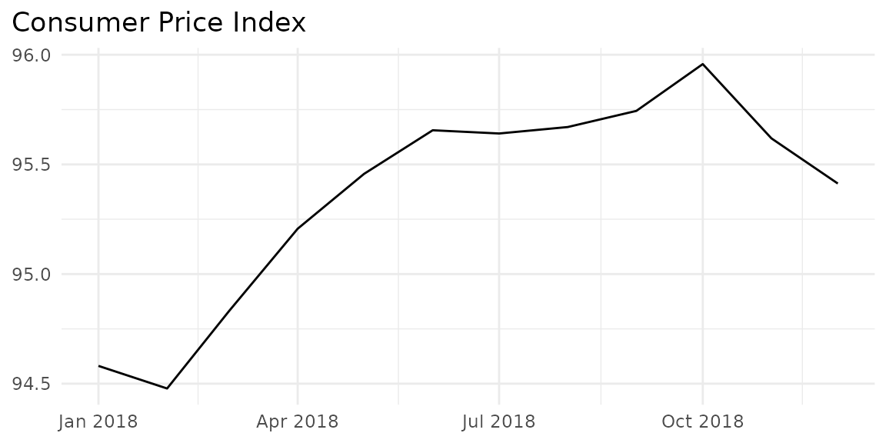
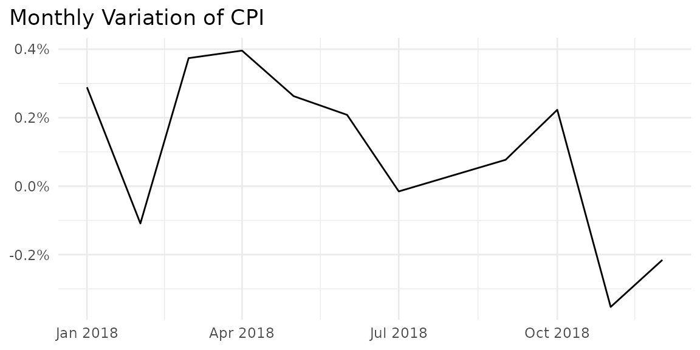
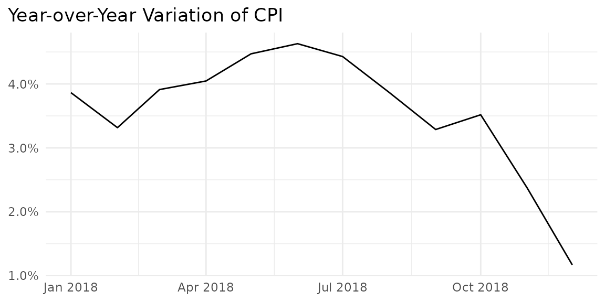
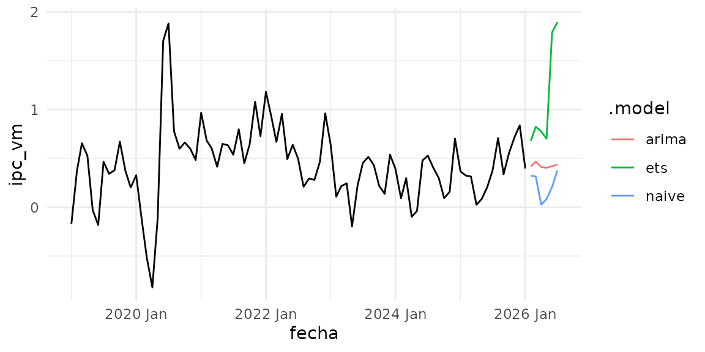

# Dominican Inflation Data

``` r
library(databcrd)
library(ggplot2)
library(dplyr)
```

Inflation is undoubtedly one of the most important macroeconomic
variables and the core of the monetary policy in the Dominican Republic.
Its evolution affects the stability of real variables such as
consumption and investment, attracting analysts’ attention and being
frequently consulted.

This article demonstrates how to quickly access inflation expectations
in the Dominican Republic using the
[databcrd](https://johan-rosa.github.io/databcrd/) package, specifically
the
[`get_ipc_data()`](https://johan-rosa.github.io/databcrd/reference/get_ipc_data.md)
function.

## Published Inflation Breakdowns

1.  General: National inflation without breakdowns
2.  By groups: Breakdown by groups of goods and services
3.  By regions: Inflation specific to the country’s macro-regions
4.  By components: Inflation of tradable and non-tradable goods
5.  Core: Core inflation, excluding volatile items
6.  Items:

With the package, all inflation breakdowns can be accessed using the
[`get_ipc_data()`](https://johan-rosa.github.io/databcrd/reference/get_ipc_data.md)
function. Simply specify the `desagregacion` argument. The possible
values are: `"general"`, `"grupos"`, `"subyacente"`, `"regiones"`,
`"tnt"`, and `"articulos"`.

## General Inflation

With `get_ipc_data("general")`, the updated general inflation data is
downloaded, including the index (`ipc`), monthly variation (`ipc_vm`),
year-over-year variation (`ipc_vi`), variation since December
(`ipc_vd`), and the 12-month average variation (`ipc_p12`).

``` r
inflacion_general <- get_ipc_data("general")
inflacion_general
#> # A tibble: 505 × 8
#>    fecha      year    mes   ipc ipc_vm ipc_vd ipc_vi ipc_p12
#>    <date>     <chr> <dbl> <dbl>  <dbl>  <dbl>  <dbl>   <dbl>
#>  1 1984-01-01 1984      1  1.38  1.74    1.74   7.05    5.57
#>  2 1984-02-01 1984      2  1.42  2.81    4.60  11.2     6.01
#>  3 1984-03-01 1984      3  1.44  1.23    5.89  11.9     6.52
#>  4 1984-04-01 1984      4  1.46  1.57    7.55  14.9     7.36
#>  5 1984-05-01 1984      5  1.48  1.20    8.84  15.2     8.26
#>  6 1984-06-01 1984      6  1.54  4.31   13.5   19.6     9.49
#>  7 1984-07-01 1984      7  1.56  1.29   15.0   20.7    10.8 
#>  8 1984-08-01 1984      8  1.57  0.455  15.5   20.1    12.0 
#>  9 1984-09-01 1984      9  1.64  4.69   20.9   24.8    13.7 
#> 10 1984-10-01 1984     10  1.68  2.34   23.8   26.3    15.4 
#> # ℹ 495 more rows
```

Let’s generate graphs for each variable.

``` r
# Function to plot inflation data
plot_ipc_data <- function(data, variable, title, start_year = 2018) {
  data |>
    filter(year == start_year) |> 
    ggplot(aes(x = fecha, y = {{ variable }})) +
    geom_line() +
    theme_minimal() +
    ggtitle(title) +
    theme(
      axis.title = element_blank(),
      plot.title.position = "plot"
    )
}
```

``` r
plot_ipc_data(inflacion_general, ipc, "Consumer Price Index")
```



``` r
plot_ipc_data(inflacion_general, ipc_vm, "Monthly Variation of CPI") +
  scale_y_continuous(labels = \(x) scales::comma(x, accuracy = 0.1, suffix = "%"))
```



``` r
plot_ipc_data(inflacion_general, ipc_vi, "Year-over-Year Variation of CPI") +
  scale_y_continuous(labels = \(x) scales::comma(x, accuracy = 0.1, suffix = "%"))
```



## Now a *naive* forecast of inflation

``` r
library(tsibble)
#> 
#> Attaching package: 'tsibble'
#> The following objects are masked from 'package:base':
#> 
#>     intersect, setdiff, union
library(fable)
#> Loading required package: fabletools
library(feasts)

ts_ipc <- inflacion_general |>
  mutate(fecha = yearmonth(fecha)) |>
  select(-mes) |>
  as_tsibble(index = fecha)

models <- ts_ipc |>
  model(
    ets   = ETS(box_cox(ipc_vm, 0.3)),
    arima = ARIMA(ipc_vm),
    naive = SNAIVE(ipc_vm)
  )

models
#> # A mable: 1 x 3
#>            ets                     arima    naive
#>        <model>                   <model>  <model>
#> 1 <ETS(A,N,A)> <ARIMA(3,1,1)(2,0,0)[12]> <SNAIVE>
```

``` r
models |>
  forecast(h = "6 months") %>% 
  autoplot(filter(ts_ipc, year > 2018), level = NULL) +
  theme_minimal()
#> Warning: `autoplot.fbl_ts()` was deprecated in fabletools 0.6.0.
#> ℹ Please use `ggtime::autoplot.fbl_ts()` instead.
#> ℹ Graphics functions have been moved to the {ggtime} package. Please use
#>   `library(ggtime)` instead.
#> This warning is displayed once per session.
#> Call `lifecycle::last_lifecycle_warnings()` to see where this warning was
#> generated.
```


